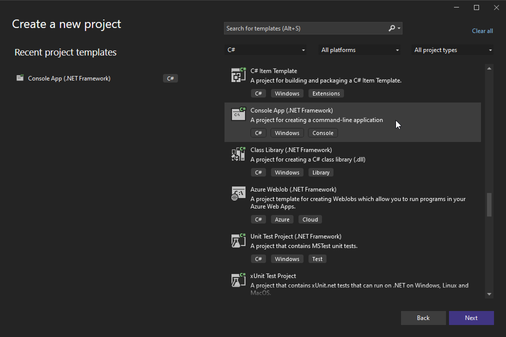
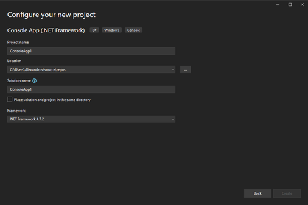
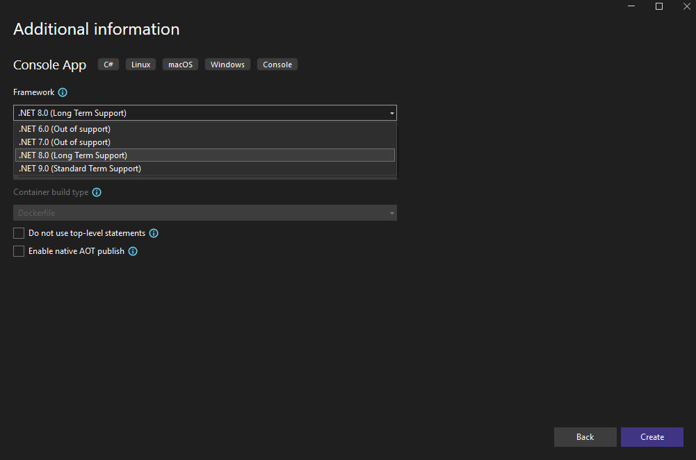

# Basic Usage

### Prerequisites
* Basic C# knowledge
* Visual Studio 2022 or later, with .NET 8.0 SDK
* [A copy of UAssetAPI](./build.md)

### Basic Project Setup
In this short guide, we will go over the very basics of parsing assets through UAssetAPI.

UAssetAPI targets [.NET 8.0](https://dotnet.microsoft.com/en-us/download/dotnet/8.0), which means you will need the .NET 8.0 SDK to use UAssetAPI. We will start off in this specific guide by creating a new C# Console App project in Visual Studio, making sure we specifically target .NET 8.0:





Once we have entered Visual Studio, we must add a new reference to our UAssetAPI.dll file. This can be done by right-clicking under "References," clicking "Add Reference," clicking "Browse" in the bottom right of the Reference Manager window, browsing to your UAssetAPI.dll file on disk, and clicking "OK".


Once you've referenced the UAssetAPI assembly in your project, you're ready to start parsing assets!

## Using UAssetAPI with Unreal Assets
### Modifying a specific property

Every Unreal Engine 4 asset parsed with UAssetAPI is represented by the [UAsset](../api/uassetapi.uasset.md#constructors) class. The simplest way to construct a UAsset is to initialize it with the path to the asset on disk (note that if your asset has a paired .uexp file, both files must be located in the same directory, and the path should point to the .uasset file) and an [EngineVersion](../api/uassetapi.unrealtypes.engineversion.html#fields).

I will be analyzing a small asset from the video game [Ace Combat 7](https://www.bandainamcoent.com/games/ace-combat-7) (4.18) for this demonstration, which can be downloaded here:
- [plwp_6aam_a0.uasset](../samples/plwp_6aam_a0.uasset) &rarr; `C:\plwp_6aam_a0.uasset`
- [plwp_6aam_a0.uexp](../samples/plwp_6aam_a0.uexp) &rarr; `C:\plwp_6aam_a0.uasset`

Save these files to those respective locations.

If you are familiar with UAssetGUI or other tools for reverse-engineering Unreal Engine 4 assets, you will likely be aware that there are generally at least five major sections to any asset, each of which can be read and modified through UAssetAPI.

For now, let's simply modify an integer. If we open the asset in UAssetGUI and look under "Export Data," we can see all the exports that we can access; for our demonstration here, we're interested in Export 2, and we'll be modifying the "MaxRotationAngle" float.


Let's start programming! Head to the `Program.cs` file and use the following pre-written code, placed in `static void Main(string[] args)` (feel free to copy and paste):
```cs
// Instantiate the asset with the path and the engine version (4.18).
// This reads the entire asset to memory at once; use a different constructor with an AssetBinaryReader if you don't want that
UAsset myAsset = new UAsset("C:\\plwp_6aam_a0.uasset", EngineVersion.VER_UE4_18);

// We want the 2nd export, so we reference the export at index 1.
// There are many types, but any export that has regular "tagged" data like you see as properties in UAssetGUI can be cast to a NormalExport, like this one.
NormalExport myExport = (NormalExport)myAsset.Exports[1];
// Alternatively, we can reference exports by ObjectName:
// NormalExport myExport = (NormalExport)myAsset.Exports["Default__plwp_6aam_a0_C"];
// we implement the general algorithm used by UAssetAPI here later in the guide

// myExport.Data will give us a List<PropertyData> which you can enumerate if you like, but we can reference a property by name or index with the export directly.
// We know this is a FloatPropertyData because it is serialized as a FloatProperty. BoolPropertyData is a BoolProperty, ObjectPropertyData is an ObjectProperty, etc.
FloatPropertyData myFloat = (FloatPropertyData)myExport["MaxRotationAngle"];
Console.WriteLine(myFloat.Value);

// All we have to do to change this value is to set myFloat.Value, and we'll be ready to re-save the asset.
myFloat.Value = 1337;

// Save the asset back to disk with UAsset.Write and a path.
myAsset.Write("NEW.uasset");

Console.WriteLine("All done!");
Console.ReadLine();
```

The above code is an example on how we can pinpoint and modify a specific asset; running it will output a `NEW.uasset` file in the current working directory (which you can access by right-clicking your project in the Solution Explorer, clicking "Open Folder in File Explorer", and navigating to "bin/Debug") with the modified float. You can verify the change for yourself in UAssetGUI.

### More advanced modification

What if we don't know where the property is? If we don't know the exact contents of the asset before we load it, we may have to perform more advanced modification techniques based on what information we do know.

Let's say we want to modify a specific NameProperty called `InternalVariableName` in an export with the ObjectName `SCS_Node_1` (you can see this in UAssetGUI under the Export Information tab). Using the same file as above, we'll need to iterate through our exports until we find the appropriate property:

```cs
// Instantiate the asset with the path and the engine version (4.18).
// This reads the entire asset to memory at once; use a different constructor with an AssetBinaryReader if you don't want that
UAsset myAsset = new UAsset("C:\\plwp_6aam_a0.uasset", EngineVersion.VER_UE4_18);

// Iterate through all the exports
foreach (Export export in myAsset.Exports)
{
    if (!(export is NormalExport normalExport)) continue; // We know our export is a NormalExport, so if this export isn't one, it's useless to us
    if (export.ObjectName.ToString() == "SCS_Node_1") // Check; do we have the right name?
    {
        // Create a new NamePropertyData with our desired value
        normalExport["InternalVariableName"].RawValue = FName.FromString(myAsset, "Howdy!");
        break;
    }
}

// Save the asset back to disk with UAsset.Write and a path.
myAsset.Write("NEW.uasset");

Console.WriteLine("All done!");
Console.ReadLine();
```

Under the scene, we're actually doing quite a lot here:
- First, we iterate through every export.
- For every export, if it's a NormalExport, we access its ObjectName field, which is an FName object. FName objects consist of two integers, an INDEX and a VALUE. When we convert it to a string, we access the name map with the INDEX to retrieve `SCS_Node`, and suffix it with the VALUE as `_1`.
- We access the InternalVariableName property, and set its `RawValue` property. `RawValue` is a property present on all `PropertyData` objects which simply allows you to access the object's `Value` field as an `object`. We could also do `(NamePropertyData)(normalExport["InternalVariableName"]).Value` here instead.
- We create a new FName object with `FName.FromString`, which performs the inverse operation of `.ToString()`. This method will automatically add an entry at the end of the name map.

At the end of the day, we have made no assumptions about the ordering of the exports or properties, and have still performed the operation.

### Final Notes

UAssetAPI is only one layer of abstraction above the raw binary format, which means that it essentially gives you full access to every single aspect of a .uasset file. This means that performing very complex operations can be quite a challenge, so keep experimenting!

You may find it useful while learning to export assets into JSON through the `.SerializeJSON()` method or through UAssetGUI, as the JSON format very closely mirrors the way that assets are laid out in UAssetAPI. You can also find some more examples for UAssetAPI syntax and usage under the [More Examples](extras.md) page, and even more examples in the [unit tests](https://github.com/atenfyr/UAssetAPI/blob/master/UAssetAPI.Tests/AssetUnitTests.cs).
